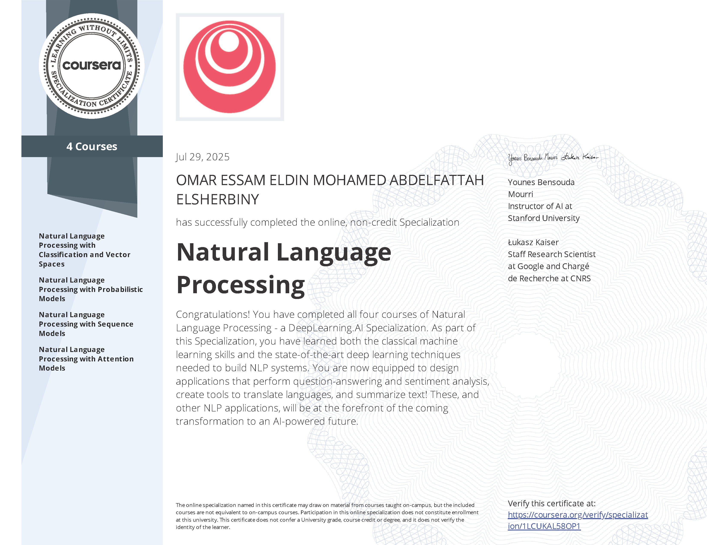

# DeepLearning.AI - Natural Language Processing Specialization (Coursera)

Author: Omar Essam (engomaressam), Email: omaressamrme@gmail.com
Issuer: DeepLearning.AI, Platform: Coursera

This repository presents the completed NLP Specialization and includes all course folders and every certificate (specialization + per-course). Documents (PDF, PPT, DOC, XLS) and relevant assets are kept; large media (e.g., videos) are excluded.

## Certificates

### Specialization
- PDF: [Natural Language Processing Specialization - Coursera 1LCUKAL58OP1.pdf](./Natural Language Processing Specialization - Coursera 1LCUKAL58OP1.pdf)

### Course Certificates

#### C01 - Classification and Vector Spaces
- PDF: [NLP with Classification and Vector Spaces - Coursera 98FKBX77YRTC.pdf](./C01 - Classification and Vector Spaces/NLP with Classification and Vector Spaces - Coursera 98FKBX77YRTC.pdf)

#### C02 - Probabilistic Models
- PDF: [Natural Language Processing with Probabilistic Models - Coursera NXNOF44KOO1N.pdf](./C02 - Probabilistic Models/Natural Language Processing with Probabilistic Models - Coursera NXNOF44KOO1N.pdf)

#### C03 - Sequence Models
- PDF: [Natural Language Processing with Sequence Models - Coursera NO0V8IOIM663.pdf](./C03 - Sequence Models/Natural Language Processing with Sequence Models - Coursera NO0V8IOIM663.pdf)

#### C04 - Attention Models
- PDF: [Natural Language Processing with Attention Models - Coursera 61N43UNA8PTR.pdf](./C04 - Attention Models/Natural Language Processing with Attention Models - Coursera 61N43UNA8PTR.pdf)

